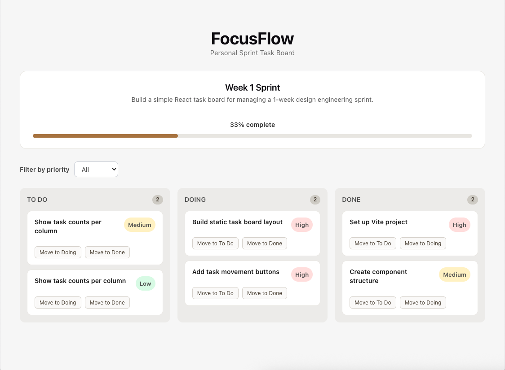
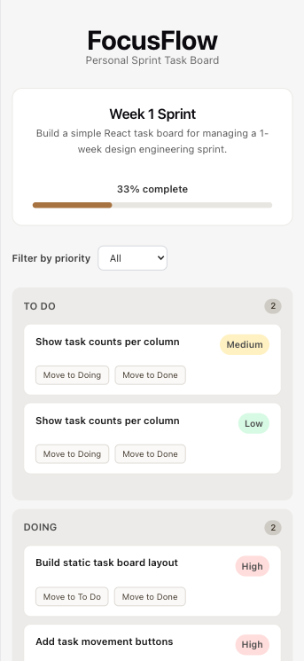

# FocusFlow

FocusFlow is a simple React sprint task board built for managing weekly design engineering work.

The project was created as part of a 1-week frontend sprint focused on learning React fundamentals through shipping a functional product prototype.

---

## Prototype Disclaimer

FocusFlow is a frontend learning prototype.

The current version focuses on:

- React fundamentals
- state management
- UI architecture
- responsive frontend implementation

The project does not yet include:

- task creation
- editing/deleting tasks
- persistence/database storage
- authentication
- multi-user functionality

Tasks are currently hardcoded for demonstration purposes.

---

## Features

- Move tasks between workflow columns
- Priority labels and filtering
- Sprint progress tracking
- Responsive desktop/mobile layout
- Empty column states
- Clean component-based architecture

---

## Tech Stack

- React
- Vite
- CSS

---

## Screenshots

### Desktop



### Mobile



---

## Live Demo

https://focusflow-task-board.netlify.app/

---

## Run Locally

```bash
npm install
npm run dev
```

---

## Learning Goals

This project focused on:

- React components
- Props
- useState
- Event handling
- Conditional rendering
- Derived state
- Responsive layout
- GitHub shipping workflow

---

## Project Status

Week 1 prototype complete.
Future improvements may include:

- backlog column
- task creation flow
- localStorage persistence
- drag-and-drop interactions
